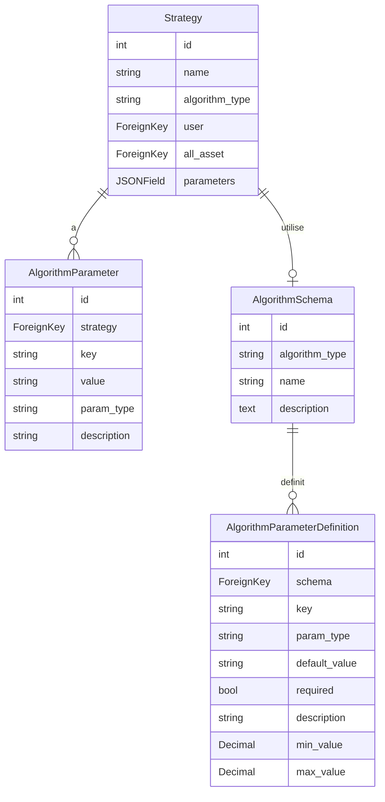

# Refactorisation des Paramètres de Stratégie - Documentation Complète

## ✅ Statut : Implémenté et Déployé

Cette refactorisation a été complètement implémentée. Le système permet maintenant de gérer les paramètres de stratégie de manière typée et extensible.

## Objectif

Implémenter un système de paramètres typés pour les stratégies avec des modèles dédiés (`AlgorithmParameter`, `AlgorithmSchema`, `AlgorithmParameterDefinition`) et créer le système d'algorithmes de trading (`TradingAlgorithm`, `AlgorithmFactory`). Conserver le champ `parameters` (JSONField) pour compatibilité backward pendant la transition.

## Architecture

### Diagramme des relations



## Étapes d'implémentation

### 1. Créer les nouveaux modèles

**Fichier**: `backend/apps/trading/models/strategies.py`

- Ajouter `AlgorithmParameter` : Modèle pour stocker les paramètres d'un algorithme
  - `strategy` : ForeignKey vers Strategy
  - `key` : CharField(max_length=100)
  - `value` : TextField (stockée en string, convertie selon param_type)
  - `param_type` : CharField(max_length=10) - 'int', 'float', 'str', 'bool'
  - `description` : CharField(max_length=255, blank=True)
  - Méthode `get_value()` : Convertit value selon param_type

- Ajouter `AlgorithmSchema` : Modèle pour définir la structure d'un type d'algorithme
  - `algorithm_type` : CharField(max_length=50, unique=True)
  - `name` : CharField(max_length=100)
  - `description` : TextField(blank=True)

- Ajouter `AlgorithmParameterDefinition` : Modèle pour définir les paramètres attendus
  - `schema` : ForeignKey vers AlgorithmSchema
  - `key` : CharField(max_length=100)
  - `param_type` : CharField(max_length=10)
  - `default_value` : TextField(blank=True)
  - `required` : BooleanField(default=True)
  - `description` : CharField(max_length=255, blank=True)
  - `min_value` : DecimalField(null=True, blank=True)
  - `max_value` : DecimalField(null=True, blank=True)

- Conserver le champ `parameters` (JSONField) dans `Strategy` pour compatibilité

### 2. Ajouter algorithm_type et méthodes dans Strategy

**Fichier**: `backend/apps/trading/models/strategies.py`

- Ajouter classe `AlgorithmType` (TextChoices) :
  - THRESHOLD = 'threshold', 'Threshold'
  - MA_CROSSOVER = 'ma_crossover', 'Moving Average Crossover'
  - RSI = 'rsi', 'RSI'
  - BOLLINGER = 'bollinger', 'Bollinger Bands'
  - MACD = 'macd', 'MACD'
  - GRID = 'grid', 'Grid Trading'

- Ajouter champ `algorithm_type` : CharField avec choices=AlgorithmType.choices, null=True, blank=True

- Ajouter méthodes dans Strategy :
  - `get_parameters_dict()` : Retourne dict, priorité AlgorithmParameter, fallback JSONField
  - `set_parameter(key, value, param_type, description='')` : Crée ou met à jour un paramètre
  - `get_parameter(key, default=None)` : Récupère un paramètre avec conversion de type
  - `validate_parameters()` : Valide selon le schéma, retourne liste d'erreurs
  - `initialize_default_parameters()` : Initialise depuis AlgorithmSchema si existe
  - `get_algorithm_instance()` : Retourne instance TradingAlgorithm avec les paramètres

### 3. Créer le système d'algorithmes

**Fichier**: `backend/apps/trading/algorithms.py` (nouveau)

- Classe abstraite `TradingAlgorithm` :
  - `__init__(self, parameters: Dict, strategy=None)`
  - Méthode abstraite `calculate_signals(price_data: List[Dict]) -> Dict`
  - Méthodes utilitaires `_get_prices()`, `_get_volumes()`

- Classes d'algorithmes concrets :
  - `ThresholdAlgorithm` : threshold_low, threshold_high, order_size, stop_loss
  - `MovingAverageCrossoverAlgorithm` : ma1_period, ma2_period, order_size, stop_loss
  - `RSIAlgorithm` : rsi_period, rsi_low, rsi_high, order_size, stop_loss
  - `BollingerBandsAlgorithm` : bb_period, bb_std, order_size, stop_loss
  - `MACDAlgorithm` : macd_fast, macd_slow, macd_signal, order_size, stop_loss
  - `GridTradingAlgorithm` : grid_min, grid_max, grid_levels, order_size, stop_loss

- Classe `AlgorithmFactory` :
  - Méthode statique `create_algorithm(algorithm_type, parameters, strategy=None)`

- Ajouter `numpy` et `pandas` dans `requirements.txt` si nécessaire

### 4. Créer la migration Django

- Créer migration avec `python manage.py makemigrations`
- Migration inclut :
  - Création des tables AlgorithmParameter, AlgorithmSchema, AlgorithmParameterDefinition
  - Ajout du champ algorithm_type dans Strategy
  - Indexes : (strategy, key) pour AlgorithmParameter, algorithm_type pour AlgorithmSchema

### 5. Mettre à jour les serializers

**Fichier**: `backend/apps/trading/api/serializers.py`

- Créer `AlgorithmParameterSerializer` :
  - Fields : id, key, value, param_type, description
  - Méthode `to_representation` : Convertit value selon param_type

- Créer `AlgorithmSchemaSerializer` (optionnel) :
  - Fields : id, algorithm_type, name, description, parameter_definitions

- Modifier `StrategySerializer` :
  - Ajouter `algorithm_type` dans fields
  - Ajouter `algorithm_parameters = AlgorithmParameterSerializer(many=True, read_only=True)`
  - Conserver `parameters` pour compatibilité

### 6. Mettre à jour l'admin Django

**Fichier**: `backend/apps/trading/admin.py`

- Créer `AlgorithmParameterInline` (TabularInline) :
  - model = AlgorithmParameter
  - extra = 0
  - fields = ('key', 'value', 'param_type', 'description')

- Modifier `StrategyAdmin` :
  - Ajouter `algorithm_type` dans list_display, list_filter, fieldsets
  - Ajouter `inlines = [AlgorithmParameterInline]`
  - Conserver `parameters` dans fieldsets pour compatibilité

- Créer `AlgorithmParameterDefinitionInline` (TabularInline) :
  - model = AlgorithmParameterDefinition
  - extra = 0

- Créer `AlgorithmSchemaAdmin` :
  - list_display = ['algorithm_type', 'name']
  - inlines = [AlgorithmParameterDefinitionInline]

- Créer `AlgorithmParameterAdmin` :
  - list_display = ['strategy', 'key', 'value', 'param_type']
  - list_filter = ['param_type', 'strategy']

### 7. Créer le script de management

**Fichier**: `backend/apps/trading/management/commands/init_algorithm_schemas.py` (nouveau)

- Fonctionnalités :
  - Créer les 6 AlgorithmSchema
  - Créer les AlgorithmParameterDefinition pour chaque schéma selon le tableau de référence
  - Option `--init-existing` : Initialise les paramètres par défaut pour les stratégies existantes
  - Option `--force` : Écrase les schémas existants

- Structure des données initialisées :
  1. **threshold** : threshold_low (float, 100.0), threshold_high (float, 200.0), order_size (float, 1.0), stop_loss (float, 0.05)
  2. **ma_crossover** : ma1_period (int, 20), ma2_period (int, 50), order_size (float, 1.0), stop_loss (float, 0.05)
  3. **rsi** : rsi_period (int, 14), rsi_low (int, 30), rsi_high (int, 70), order_size (float, 1.0), stop_loss (float, 0.05)
  4. **bollinger** : bb_period (int, 20), bb_std (float, 2.0), order_size (float, 1.0), stop_loss (float, 0.05)
  5. **macd** : macd_fast (int, 12), macd_slow (int, 26), macd_signal (int, 9), order_size (float, 1.0), stop_loss (float, 0.05)
  6. **grid** : grid_min (float, 100.0), grid_max (float, 200.0), grid_levels (int, 10), order_size (float, 1.0), stop_loss (float, 0.05)

### 8. Mettre à jour les imports

**Fichier**: `backend/apps/trading/models/__init__.py`

- Exporter les nouveaux modèles :
  ```python
  from .strategies import Strategy, StrategyPerformance, AlgorithmParameter, AlgorithmSchema, AlgorithmParameterDefinition
  ```

- Vérifier `backend/requirements.txt` :
  - Ajouter `numpy>=1.24.0` si nécessaire
  - Ajouter `pandas>=2.0.0` si nécessaire

## Logique de compatibilité backward

La méthode `get_parameters_dict()` dans Strategy doit :
1. Essayer de récupérer les paramètres depuis `AlgorithmParameter` (nouveau système)
2. Si aucun paramètre trouvé, fallback vers `parameters` (JSONField)
3. Cela permet une transition progressive sans casser l'existant

```python
def get_parameters_dict(self):
    """Retourne les paramètres, en priorité depuis AlgorithmParameter"""
    new_params = {
        param.key: param.get_value()
        for param in self.algorithm_parameters.all()
    }
    
    if new_params:
        return new_params
    
    # Fallback vers l'ancien système
    return self.parameters or {}
```

## Ordre d'exécution recommandé

1. ✅ Créer les modèles (AlgorithmParameter, AlgorithmSchema, AlgorithmParameterDefinition)
2. ✅ Ajouter algorithm_type et méthodes dans Strategy
3. ✅ Créer le système d'algorithmes (algorithms.py)
4. ✅ Créer la migration Django et l'appliquer
5. ✅ Mettre à jour les serializers
6. ✅ Mettre à jour l'admin
7. ✅ Créer le script init_algorithm_schemas.py
8. ✅ Mettre à jour models/__init__.py
9. ✅ Vérifier requirements.txt et installer numpy/pandas si nécessaire
10. ✅ Tests manuels dans l'admin Django

## Fichiers à créer/modifier

**Nouveaux fichiers** :
- `backend/apps/trading/algorithms.py`
- `backend/apps/trading/management/commands/init_algorithm_schemas.py`

**Fichiers à modifier** :
- `backend/apps/trading/models/strategies.py` - Ajouter les modèles et méthodes
- `backend/apps/trading/models/__init__.py` - Exporter les nouveaux modèles
- `backend/apps/trading/api/serializers.py` - Ajouter algorithm_type et algorithm_parameters
- `backend/apps/trading/admin.py` - Ajouter les admins et inlines
- `backend/requirements.txt` - Ajouter numpy et pandas si nécessaire

**Migration Django** :
- Créer via `python manage.py makemigrations trading`

## Notes importantes

- Le champ `parameters` (JSONField) est conservé pour compatibilité backward
- Les méthodes de Strategy gèrent automatiquement la transition (nouveau système en priorité, fallback vers JSONField)
- Aucune migration de données n'est effectuée dans ce plan (structure uniquement)
- Les algorithmes sont basés sur ceux de la version 3, adaptés à la structure de la version 4
- Les algorithmes nécessitent numpy et pandas pour les calculs (RSI, MACD, Bollinger, etc.)

## Références

- Document source : `Trading_app_version3/trading_app_version3/REFACTORING_STRATEGY_PARAMETERS.md`
- Algorithmes de référence : `Trading_app_version3/trading_app_version3/trading_app/algorithms.py`

