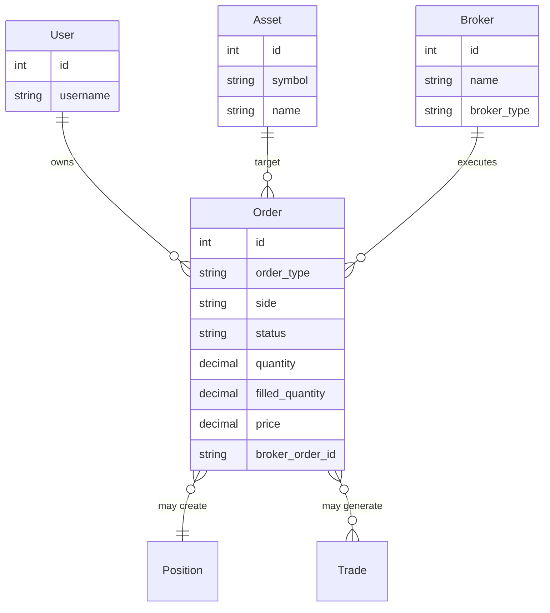

# Documentation du modèle Order

## Introduction

Le modèle `Order` représente un ordre de trading dans la base de données Django. Il stocke toutes les informations nécessaires pour suivre un ordre de sa création jusqu'à son exécution complète ou son annulation.

## Structure du modèle

### Classe Order

Fichier : `backend/apps/trading/models/trading.py` (lignes 160-220)

```python
class Order(TimeStampedModel):
    """Ordre en attente d'exécution."""
```

Le modèle hérite de `TimeStampedModel`, qui ajoute automatiquement :
- `created_at` : Date de création
- `updated_at` : Date de dernière modification

## Champs du modèle

### Relations

| Champ | Type | Description | Null | Blank |
|-------|------|-------------|------|-------|
| `user` | ForeignKey(User) | Utilisateur propriétaire de l'ordre | ❌ | ❌ |
| `asset` | ForeignKey(Asset) | Asset sur lequel porte l'ordre | ❌ | ❌ |
| `broker` | ForeignKey(Broker) | Broker utilisé pour l'ordre | ❌ | ❌ |

**Relations inverses :**
- `user.orders` : Tous les ordres de l'utilisateur
- `asset.orders` : Tous les ordres sur cet asset
- `broker.orders` : Tous les ordres via ce broker

### Champs de type d'ordre

#### `order_type`
- **Type** : `CharField(max_length=20)`
- **Choix** : `OrderType` (TextChoices)
- **Valeurs possibles** :
  - `MARKET` : Ordre au marché
  - `LIMIT` : Ordre à cours limité
  - `STOP` : Ordre stop
  - `STOP_LIMIT` : Ordre stop-limité
- **Défaut** : `MARKET`
- **Description** : Type d'ordre à exécuter

#### `side`
- **Type** : `CharField(max_length=10)`
- **Choix** : `OrderSide` (TextChoices)
- **Valeurs possibles** :
  - `BUY` : Achat
  - `SELL` : Vente
- **Description** : Sens de l'ordre (achat ou vente)

#### `status`
- **Type** : `CharField(max_length=20)`
- **Choix** : `OrderStatus` (TextChoices)
- **Valeurs possibles** :
  - `PENDING` : En attente de soumission
  - `OPEN` : Ouvert et actif
  - `FILLED` : Complètement exécuté
  - `PARTIALLY_FILLED` : Partiellement exécuté
  - `CANCELLED` : Annulé
  - `REJECTED` : Rejeté par le broker
  - `EXPIRED` : Expiré
- **Défaut** : `PENDING`
- **Description** : Statut actuel de l'ordre

### Champs quantitatifs

#### `quantity`
- **Type** : `DecimalField(max_digits=20, decimal_places=8)`
- **Null** : ❌
- **Blank** : ❌
- **Description** : Quantité totale de l'ordre
- **Exemple** : `Decimal('10.5')` pour 10.5 unités

#### `filled_quantity`
- **Type** : `DecimalField(max_digits=20, decimal_places=8)`
- **Défaut** : `0`
- **Description** : Quantité déjà exécutée
- **Exemple** : Si `quantity=10` et `filled_quantity=3.5`, 35% de l'ordre est exécuté

#### `price`
- **Type** : `DecimalField(max_digits=20, decimal_places=8)`
- **Null** : ✅
- **Blank** : ✅
- **Description** : Prix limite (pour LIMIT et STOP_LIMIT)
- **Exemple** : `Decimal('150.25')` pour un ordre limite à 150.25

#### `stop_price`
- **Type** : `DecimalField(max_digits=20, decimal_places=8)`
- **Null** : ✅
- **Blank** : ✅
- **Description** : Prix stop (pour STOP et STOP_LIMIT)
- **Exemple** : `Decimal('145.00')` pour déclencher l'ordre à 145.00

### Champs d'identification

#### `broker_order_id`
- **Type** : `CharField(max_length=100)`
- **Blank** : ✅ (défaut : chaîne vide)
- **Description** : Identifiant de l'ordre chez le broker
- **Exemple** : `"123456789"` (Binance), `"OrderId_123"` (Saxo)

## Enums et choix

### OrderType

```python
class OrderType(models.TextChoices):
    MARKET = 'MARKET', 'Market'
    LIMIT = 'LIMIT', 'Limit'
    STOP = 'STOP', 'Stop'
    STOP_LIMIT = 'STOP_LIMIT', 'Stop Limit'
```

### OrderSide

```python
class OrderSide(models.TextChoices):
    BUY = 'BUY', 'Achat'
    SELL = 'SELL', 'Vente'
```

### OrderStatus

```python
class OrderStatus(models.TextChoices):
    PENDING = 'PENDING', 'En attente'
    OPEN = 'OPEN', 'Ouvert'
    FILLED = 'FILLED', 'Exécuté'
    PARTIALLY_FILLED = 'PARTIALLY_FILLED', 'Partiellement exécuté'
    CANCELLED = 'CANCELLED', 'Annulé'
    REJECTED = 'REJECTED', 'Rejeté'
    EXPIRED = 'EXPIRED', 'Expiré'
```

## Méthodes et propriétés

### `__str__()`

Représentation string de l'ordre :

```python
def __str__(self):
    return f"{self.side} {self.quantity} {self.asset.symbol} ({self.status})"
```

**Exemple** : `"BUY 10.5 BTCUSDT (OPEN)"`

## Validations métier

### Validations au niveau du modèle

Les validations sont gérées principalement au niveau du serializer (`OrderSerializer`), mais certaines règles métier s'appliquent :

1. **LIMIT orders** : Requièrent un `price`
2. **STOP orders** : Requièrent un `stop_price`
3. **STOP_LIMIT orders** : Requièrent à la fois `price` et `stop_price`
4. **MARKET orders** : Ne requièrent pas de prix (exécution au marché)

### Contraintes de données

- `quantity` doit être positif (validation dans le serializer)
- `filled_quantity` ne peut pas dépasser `quantity`
- `status` doit être dans la liste des statuts valides

## Index et contraintes

### Meta options

```python
class Meta:
    ordering = ['-created_at']  # Tri par défaut : plus récent d'abord
    verbose_name = 'Order'
    verbose_name_plural = 'Orders'
```

### Index automatiques

Django crée automatiquement des index pour :
- `user` (ForeignKey)
- `asset` (ForeignKey)
- `broker` (ForeignKey)

### Index recommandés

Pour optimiser les requêtes fréquentes, considérer l'ajout d'index sur :
- `status` : Pour filtrer par statut (`pending`, `filled`, etc.)
- `created_at` : Pour le tri chronologique
- `broker_order_id` : Pour rechercher un ordre par ID broker

## Relations avec d'autres modèles

### Diagramme des relations



### Relations inverses utiles

```python
# Tous les ordres d'un utilisateur
user.orders.all()

# Tous les ordres sur un asset
asset.orders.all()

# Tous les ordres via un broker
broker.orders.all()

# Filtrer par statut
user.orders.filter(status=Order.OrderStatus.PENDING)
```

## OrderSerializer

Fichier : `backend/apps/trading/api/serializers.py` (lignes 351-412)

### Champs du serializer

Le serializer enrichit le modèle avec :

1. **Relations imbriquées** (lecture seule) :
   - `asset` : `AssetNestedSerializer` - Informations complètes de l'asset
   - `broker_name` : Nom du broker (via `broker.name`)

2. **IDs pour création** (écriture) :
   - `asset_id` : ID de l'asset (write_only)
   - `broker_id` : ID du broker (write_only)

3. **Champs calculés** :
   - `fill_percentage` : Pourcentage de remplissage (méthode)

### fill_percentage

Propriété calculée indiquant le pourcentage d'exécution :

```python
def get_fill_percentage(self, obj):
    """Calcule le % de remplissage de l'ordre."""
    if obj.quantity and obj.quantity > 0:
        return round((obj.filled_quantity / obj.quantity) * 100, 2)
    return 0
```

**Exemple** :
- `quantity = 10`, `filled_quantity = 3.5` → `fill_percentage = 35.0`
- `quantity = 10`, `filled_quantity = 10` → `fill_percentage = 100.0`

### Validations du serializer

#### Validation de quantité

```python
def validate_quantity(self, value):
    """Valider que la quantité est positive."""
    if value <= 0:
        raise serializers.ValidationError("La quantité doit être positive")
    return value
```

#### Validation multi-champs

```python
def validate(self, data):
    """Validations multi-champs."""
    order_type = data.get('order_type')
    price = data.get('price')
    stop_price = data.get('stop_price')
    
    # Limit orders nécessitent un prix
    if order_type == 'LIMIT' and not price:
        raise serializers.ValidationError({
            'price': "Un ordre LIMIT nécessite un prix"
        })
    
    # Stop orders nécessitent un stop_price
    if order_type in ['STOP', 'STOP_LIMIT'] and not stop_price:
        raise serializers.ValidationError({
            'stop_price': "Un ordre STOP nécessite un stop_price"
        })
    
    return data
```

## Exemples d'utilisation

### Créer un ordre MARKET

```python
from apps.trading.models import Order
from decimal import Decimal

order = Order.objects.create(
    user=user,
    asset=asset,
    broker=broker,
    order_type=Order.OrderType.MARKET,
    side=Order.OrderSide.BUY,
    quantity=Decimal('10.5'),
    status=Order.OrderStatus.PENDING
)
```

### Créer un ordre LIMIT

```python
order = Order.objects.create(
    user=user,
    asset=asset,
    broker=broker,
    order_type=Order.OrderType.LIMIT,
    side=Order.OrderSide.BUY,
    quantity=Decimal('10'),
    price=Decimal('150.25'),
    status=Order.OrderStatus.PENDING
)
```

### Mettre à jour le statut

```python
# Marquer comme ouvert
order.status = Order.OrderStatus.OPEN
order.broker_order_id = "123456"
order.save()

# Mettre à jour la quantité exécutée
order.filled_quantity = Decimal('5.5')
if order.filled_quantity >= order.quantity:
    order.status = Order.OrderStatus.FILLED
order.save()
```

### Requêtes courantes

```python
# Ordres en attente d'un utilisateur
pending_orders = Order.objects.filter(
    user=user,
    status__in=[Order.OrderStatus.PENDING, Order.OrderStatus.OPEN]
)

# Ordres exécutés aujourd'hui
from django.utils import timezone
today = timezone.now().date()
filled_today = Order.objects.filter(
    user=user,
    status=Order.OrderStatus.FILLED,
    updated_at__date=today
)

# Ordres partiellement exécutés
partial = Order.objects.filter(
    user=user,
    status=Order.OrderStatus.PARTIALLY_FILLED
)

# Ordres par asset
asset_orders = Order.objects.filter(
    asset=asset
).order_by('-created_at')
```

## Migration et schéma

### Migration initiale

Le modèle est créé via une migration Django standard. Pour créer/modifier :

```bash
python manage.py makemigrations trading
python manage.py migrate
```

### Champs indexables

Pour améliorer les performances, considérer l'ajout d'index composites :

```python
class Meta:
    indexes = [
        models.Index(fields=['user', 'status']),
        models.Index(fields=['user', '-created_at']),
        models.Index(fields=['asset', 'status']),
        models.Index(fields=['broker', 'status']),
    ]
```

## Notes importantes

1. **Modèle Order vs PendingOrder** : Le système utilise un seul modèle `Order` avec différents statuts. "PendingOrder" fait référence aux ordres avec statut `PENDING`, `OPEN` ou `PARTIALLY_FILLED`.

2. **broker_order_id** : Cet ID peut changer selon le broker. Binance utilise des entiers, Saxo utilise des strings. Le champ est donc un `CharField` pour accommoder les deux.

3. **filled_quantity** : Mise à jour manuelle ou via synchronisation avec le broker. Le système ne met pas à jour automatiquement ce champ lors de l'exécution.

4. **Précision décimale** : Les champs `DecimalField` utilisent 20 chiffres au total et 8 décimales, permettant de gérer des valeurs très grandes avec une grande précision (ex: cryptomonnaies).

## Fichiers de référence

- **Modèle Order** : `backend/apps/trading/models/trading.py` (lignes 160-220)
- **Serializer** : `backend/apps/trading/api/serializers.py` (lignes 351-412)

