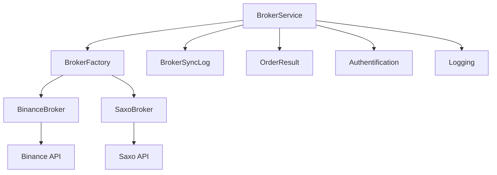
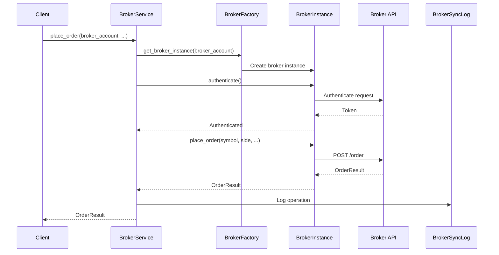

# Services et logique métier - Système d'ordres

## Introduction

Ce document décrit les services et la logique métier pour la gestion des ordres. Le `BrokerService` fournit une interface unifiée pour placer et gérer des ordres à travers différents brokers (Binance, Saxo Bank) en utilisant le pattern Factory.

## BrokerService

### Vue d'ensemble

Fichier : `backend/apps/trading/services/broker_service.py`

Le `BrokerService` est un service de haut niveau qui :

- Gère les instances de brokers via le pattern Factory
- Fournit une interface unifiée pour placer des ordres
- Gère l'authentification automatique
- Log les opérations dans `BrokerSyncLog`
- Gère les erreurs et exceptions

### Architecture



## Méthode place_order

### Signature

Fichier : `backend/apps/trading/services/broker_service.py` (lignes 420-488)

```python
def place_order(
    self,
    broker_account: BrokerAccount,
    symbol: str,
    side: str,
    quantity: Decimal,
    order_type: str = 'MARKET',
    price: Optional[Decimal] = None,
    stop_price: Optional[Decimal] = None,
    **kwargs
) -> OrderResult:
```

### Paramètres

| Paramètre | Type | Requis | Description |
|-----------|------|--------|-------------|
| `broker_account` | BrokerAccount | ✅ | Compte broker Django |
| `symbol` | str | ✅ | Symbole de l'asset |
| `side` | str | ✅ | "BUY" ou "SELL" |
| `quantity` | Decimal | ✅ | Quantité à acheter/vendre |
| `order_type` | str | ❌ | Type d'ordre (défaut: "MARKET") |
| `price` | Decimal | ❌ | Prix limite |
| `stop_price` | Decimal | ❌ | Prix stop |
| `**kwargs` | dict | ❌ | Paramètres supplémentaires spécifiques au broker |

### Flux d'exécution



### Exemple d'utilisation

```python
from apps.trading.services.broker_service import BrokerService
from apps.trading.models import BrokerAccount
from decimal import Decimal

# Initialiser le service
service = BrokerService(user)

# Récupérer le compte broker
broker_account = BrokerAccount.objects.get(
    user=user,
    broker_type='BINANCE'
)

# Placer un ordre MARKET
result = service.place_order(
    broker_account=broker_account,
    symbol="BTCUSDT",
    side="BUY",
    quantity=Decimal('0.001'),
    order_type="MARKET"
)

if result.success:
    print(f"✅ Ordre placé: {result.order_id}")
    print(f"Message: {result.message}")
else:
    print(f"❌ Erreur: {result.error}")
```

### Gestion de l'authentification

Le service vérifie automatiquement l'authentification avant de placer un ordre :

```python
broker = self.get_broker_instance(broker_account)

if not broker.authenticate():
    return OrderResult(
        success=False,
        error="Authentication failed"
    )
```

**Si l'authentification échoue :**
- Retourne immédiatement `OrderResult(success=False, error="Authentication failed")`
- Ne tente pas de placer l'ordre
- N'enregistre pas de log

### Logging des opérations

Chaque placement d'ordre est loggé dans `BrokerSyncLog` :

```python
self._log_sync(
    broker_account=broker_account,
    sync_type='order_placed',
    status='success' if result.success else 'error',
    details={
        'symbol': symbol,
        'side': side,
        'quantity': str(quantity),
        'order_type': order_type,
        'order_id': result.order_id,
    },
    error_message=result.error if not result.success else '',
)
```

**Informations loggées :**
- `sync_type` : `'order_placed'`
- `status` : `'success'` ou `'error'`
- `details` : Détails de l'ordre (symbol, side, quantity, etc.)
- `error_message` : Message d'erreur si échec

### Gestion des erreurs

Le service capture toutes les exceptions et retourne un `OrderResult` avec l'erreur :

```python
try:
    # ... placement de l'ordre ...
    return result
except Exception as e:
    logger.exception(f"Error placing order: {e}")
    return OrderResult(
        success=False,
        error=str(e)
    )
```

**Types d'erreurs possibles :**
- `BrokerAuthenticationError` : Échec d'authentification
- `BrokerAPIError` : Erreur API du broker
- `InsufficientFundsError` : Fonds insuffisants
- Exceptions génériques : Capturées et loggées

## Méthode get_orders

### Signature

Fichier : `backend/apps/trading/services/broker_service.py` (lignes 389-418)

```python
def get_orders(
    self,
    broker_account: BrokerAccount,
    status: Optional[str] = None,
    symbol: Optional[str] = None,
    limit: int = 50
) -> List[BrokerOrder]:
```

### Paramètres

| Paramètre | Type | Requis | Description |
|-----------|------|--------|-------------|
| `broker_account` | BrokerAccount | ✅ | Compte broker Django |
| `status` | str | ❌ | Filtrer par statut |
| `symbol` | str | ❌ | Filtrer par symbole |
| `limit` | int | ❌ | Nombre maximum de résultats (défaut: 50) |

### Retour

Retourne une liste de `BrokerOrder` (objets standardisés représentant des ordres du broker).

### Exemple d'utilisation

```python
# Récupérer tous les ordres ouverts
orders = service.get_orders(
    broker_account=broker_account,
    status='OPEN',
    limit=100
)

for order in orders:
    print(f"{order.symbol}: {order.order_type} {order.side} {order.quantity} - {order.status}")

# Récupérer les ordres d'un symbole spécifique
btc_orders = service.get_orders(
    broker_account=broker_account,
    symbol="BTCUSDT"
)
```

### Gestion des erreurs

Si une erreur survient, la méthode retourne une liste vide :

```python
try:
    broker = self.get_broker_instance(broker_account)
    if not broker.authenticate():
        return []
    return broker.get_orders(status=status, symbol=symbol, limit=limit)
except Exception as e:
    logger.error(f"Error getting orders: {e}")
    return []
```

## Pattern Factory

### BrokerFactory

Le `BrokerService` utilise `BrokerFactory` pour créer des instances de brokers :

```python
from ..brokers.factory import BrokerFactory

broker = BrokerFactory.create_broker(broker_account)
```

### Avantages

1. **Abstraction** : Le service ne connaît pas les détails d'implémentation de chaque broker
2. **Extensibilité** : Facile d'ajouter de nouveaux brokers
3. **Testabilité** : Facile de mocker les brokers pour les tests

### Support des brokers

| Broker | Classe | Type |
|--------|--------|------|
| Binance | `BinanceBroker` | `BINANCE` |
| Saxo Bank | `SaxoBroker` | `SAXO` |

## OrderResult

### Structure

Le `OrderResult` est un dataclass qui représente le résultat d'un placement d'ordre :

```python
@dataclass
class OrderResult:
    success: bool                    # Succès ou échec
    order_id: Optional[str] = None   # ID de l'ordre chez le broker
    message: str = ''                # Message informatif
    error: Optional[str] = None      # Message d'erreur si échec
    raw_data: Optional[Dict] = None  # Données brutes de la réponse
```

Fichier : `backend/apps/trading/brokers/base.py` (lignes 86-93)

### Utilisation

```python
result = service.place_order(...)

if result.success:
    # Ordre placé avec succès
    order_id = result.order_id
    message = result.message
    raw_data = result.raw_data  # Données complètes de la réponse broker
else:
    # Erreur
    error = result.error
```

## BrokerOrder

### Structure

Le `BrokerOrder` représente un ordre standardisé depuis un broker :

```python
@dataclass
class BrokerOrder:
    symbol: str                      # Symbole de l'asset
    order_type: str                  # Type d'ordre
    side: str                        # BUY ou SELL
    quantity: Decimal                # Quantité
    price: Optional[Decimal] = None  # Prix (si applicable)
    status: str = 'PENDING'          # Statut de l'ordre
    filled_quantity: Decimal = Decimal('0')  # Quantité exécutée
    broker_order_id: Optional[str] = None    # ID chez le broker
    raw_data: Optional[Dict] = None          # Données brutes
```

Fichier : `backend/apps/trading/brokers/base.py` (lignes 72-83)

### Utilisation

```python
orders = service.get_orders(broker_account)

for order in orders:
    print(f"Order {order.broker_order_id}: {order.symbol} {order.side} {order.quantity}")
    print(f"Status: {order.status}, Filled: {order.filled_quantity}/{order.quantity}")
```

## Exemples d'utilisation complets

### Placement d'ordres multiples

```python
from decimal import Decimal

symbols = ["BTCUSDT", "ETHUSDT", "BNBUSDT"]
results = []

for symbol in symbols:
    result = service.place_order(
        broker_account=broker_account,
        symbol=symbol,
        side="BUY",
        quantity=Decimal('0.001'),
        order_type="MARKET"
    )
    results.append((symbol, result))

# Afficher les résultats
for symbol, result in results:
    if result.success:
        print(f"✅ {symbol}: {result.order_id}")
    else:
        print(f"❌ {symbol}: {result.error}")
```

### Ordre LIMIT avec gestion d'erreur avancée

```python
result = service.place_order(
    broker_account=broker_account,
    symbol="BTCUSDT",
    side="BUY",
    quantity=Decimal('0.001'),
    order_type="LIMIT",
    price=Decimal('50000.00')
)

if result.success:
    print(f"✅ Ordre LIMIT placé")
    print(f"ID: {result.order_id}")
    print(f"Message: {result.message}")
    
    # Sauvegarder l'ordre dans la base de données
    Order.objects.create(
        user=user,
        asset=asset,
        broker=broker_account.broker,
        order_type=Order.OrderType.LIMIT,
        side=Order.OrderSide.BUY,
        quantity=Decimal('0.001'),
        price=Decimal('50000.00'),
        broker_order_id=result.order_id,
        status=Order.OrderStatus.OPEN
    )
else:
    error = result.error
    if "insufficient" in error.lower():
        print("❌ Fonds insuffisants")
    elif "LOT_SIZE" in error:
        print("❌ Quantité invalide (vérifier les filtres)")
    else:
        print(f"❌ Erreur: {error}")
```

### Synchronisation des ordres

```python
# Récupérer les ordres depuis le broker
broker_orders = service.get_orders(
    broker_account=broker_account,
    status='OPEN'
)

# Mettre à jour les ordres dans la base de données
for broker_order in broker_orders:
    try:
        order = Order.objects.get(
            broker_order_id=broker_order.broker_order_id,
            user=user
        )
        
        # Mettre à jour le statut et la quantité exécutée
        order.status = map_status_from_broker(broker_order.status)
        order.filled_quantity = broker_order.filled_quantity
        
        if broker_order.filled_quantity >= order.quantity:
            order.status = Order.OrderStatus.FILLED
        
        order.save()
    except Order.DoesNotExist:
        # Créer un nouvel ordre si non trouvé
        Order.objects.create(
            user=user,
            asset=get_asset_by_symbol(broker_order.symbol),
            broker=broker_account.broker,
            order_type=broker_order.order_type,
            side=broker_order.side,
            quantity=broker_order.quantity,
            filled_quantity=broker_order.filled_quantity,
            status=map_status_from_broker(broker_order.status),
            broker_order_id=broker_order.broker_order_id
        )
```

## Logging et monitoring

### BrokerSyncLog

Chaque opération est loggée dans `BrokerSyncLog` pour le suivi et le debugging.

**Champs importants :**
- `sync_type` : Type d'opération (`'order_placed'`, `'order_cancelled'`)
- `status` : `'success'` ou `'error'`
- `details` : JSON avec les détails de l'opération
- `error_message` : Message d'erreur si applicable

### Exemple de log

```python
# Log d'un ordre placé avec succès
{
    "sync_type": "order_placed",
    "status": "success",
    "details": {
        "symbol": "BTCUSDT",
        "side": "BUY",
        "quantity": "0.001",
        "order_type": "MARKET",
        "order_id": "123456789"
    },
    "error_message": null
}

# Log d'un ordre avec erreur
{
    "sync_type": "order_placed",
    "status": "error",
    "details": {
        "symbol": "BTCUSDT",
        "side": "BUY",
        "quantity": "0.001",
        "order_type": "LIMIT",
        "order_id": null
    },
    "error_message": "Insufficient funds"
}
```

## Gestion du cache des instances

Le `BrokerService` peut utiliser un cache pour réutiliser les instances de brokers :

```python
broker = self.get_broker_instance(broker_account, use_cache=True)
```

**Avantages :**
- Réduction de la création d'instances
- Réutilisation des tokens d'authentification
- Amélioration des performances

## Fichiers de référence

- **Service principal** : `backend/apps/trading/services/broker_service.py`
  - `place_order` (lignes 420-488)
  - `get_orders` (lignes 389-418)
- **Interface** : `backend/apps/trading/brokers/base.py`
  - `OrderResult` (lignes 86-93)
  - `BrokerOrder` (lignes 72-83)
- **Factory** : `backend/apps/trading/brokers/factory.py`

## Notes importantes

1. **Authentification** : Le service gère automatiquement l'authentification, mais les tokens peuvent expirer
2. **Logging** : Toutes les opérations sont loggées pour le suivi et le debugging
3. **Erreurs** : Les erreurs sont capturées et retournées dans `OrderResult.error`
4. **Cache** : Utiliser `use_cache=True` pour améliorer les performances
5. **Standardisation** : Le service fournit une interface unifiée, masquant les différences entre brokers


