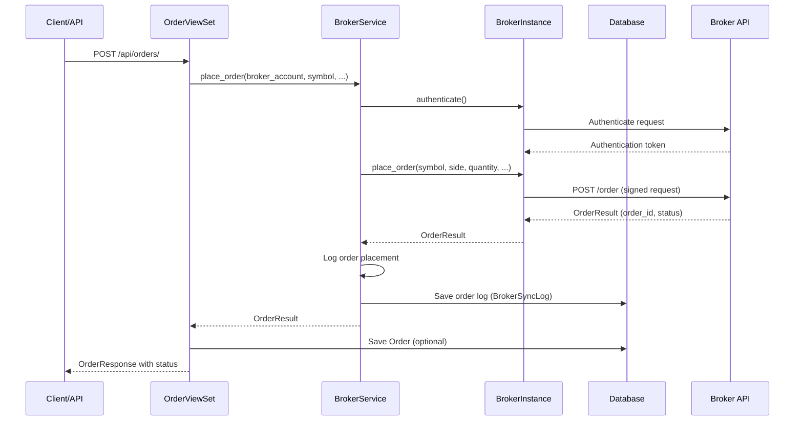
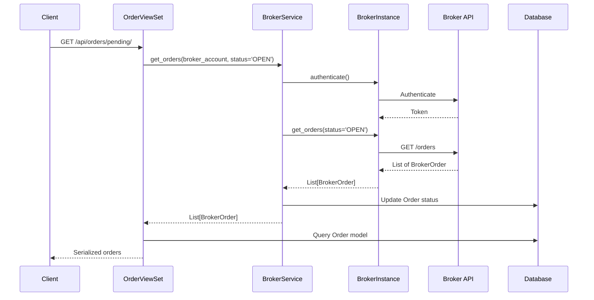
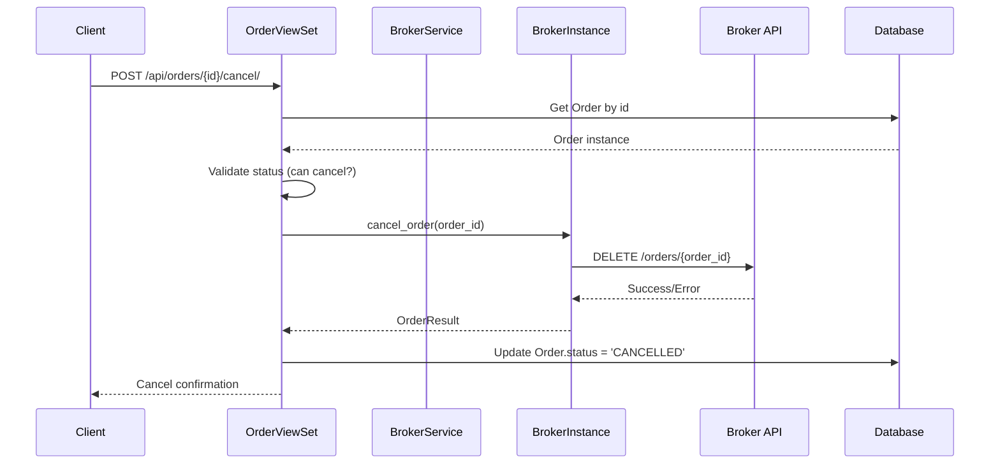
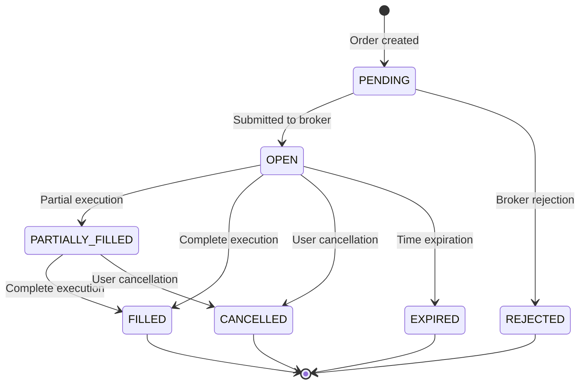
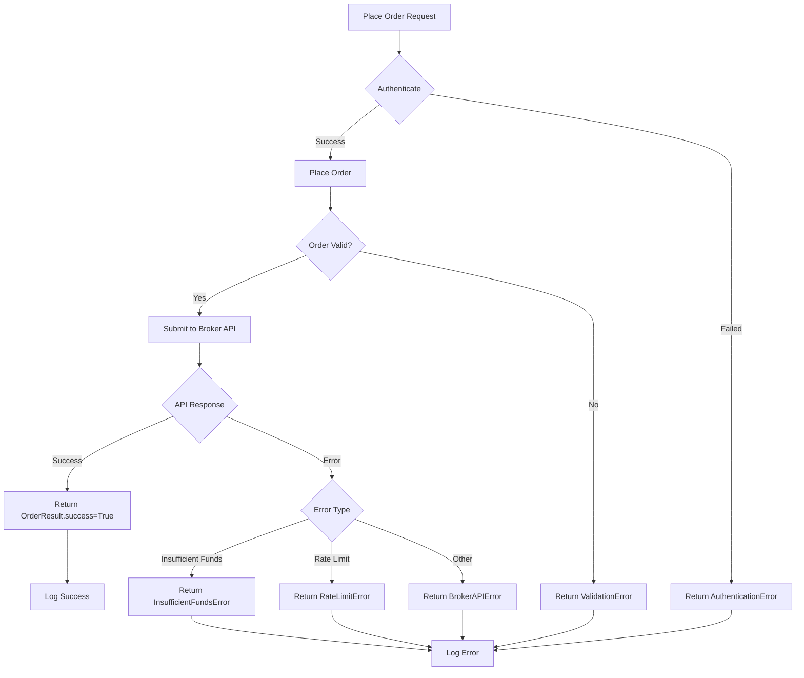

# Vue d'ensemble du système d'ordres

## Introduction

Le système d'ordres permet de placer, suivre et gérer des ordres de trading à travers différents brokers (Binance, Saxo Bank) via une interface unifiée. Ce document présente l'architecture générale, les flux de données et les concepts clés du système.

## Architecture générale

Le système d'ordres suit une architecture en couches avec séparation des responsabilités :

```
┌─────────────────────────────────────────────────────────────┐
│                    FRONTEND / API                            │
│              (REST API Endpoints)                            │
└──────────────────────┬──────────────────────────────────────┘
                       │
┌──────────────────────▼──────────────────────────────────────┐
│                  API VIEWSETS                                │
│              (OrderViewSet)                                  │
│  • CRUD operations                                          │
│  • Custom actions (pending, filled, cancel)                 │
└──────────────────────┬──────────────────────────────────────┘
                       │
┌──────────────────────▼──────────────────────────────────────┐
│                   SERVICES                                   │
│            (BrokerService)                                   │
│  • Unified order placement                                  │
│  • Broker instance management                               │
│  • Error handling & logging                                 │
└──────────────────────┬──────────────────────────────────────┘
                       │
┌──────────────────────▼──────────────────────────────────────┐
│                   BROKERS                                    │
│    ┌──────────────┐          ┌──────────────┐              │
│    │  Binance     │          │    Saxo      │              │
│    │  Broker      │          │    Broker    │              │
│    └──────────────┘          └──────────────┘              │
│         │                           │                       │
│         └───────────┬───────────────┘                       │
│                     │                                       │
│              BrokerBase (Abstract)                          │
└──────────────────────┬──────────────────────────────────────┘
                       │
┌──────────────────────▼──────────────────────────────────────┐
│                  DATABASE                                    │
│              (Order Model)                                   │
│  • Order storage                                            │
│  • Status tracking                                          │
└─────────────────────────────────────────────────────────────┘
```

## Flux de données

### Flux de placement d'ordre



### Flux de synchronisation des ordres



### Flux d'annulation d'ordre



## Types d'ordres supportés

Le système supporte quatre types d'ordres standardisés :

### 1. MARKET (Ordre au marché)
- **Description** : Ordre exécuté immédiatement au meilleur prix disponible
- **Paramètres requis** : `symbol`, `side`, `quantity`
- **Prix** : Déterminé par le marché au moment de l'exécution
- **Support** : Binance ✅, Saxo ✅

### 2. LIMIT (Ordre à cours limité)
- **Description** : Ordre exécuté uniquement si le prix atteint le niveau spécifié
- **Paramètres requis** : `symbol`, `side`, `quantity`, `price`
- **Prix** : Prix limite spécifié par l'utilisateur
- **Support** : Binance ✅, Saxo ✅

### 3. STOP (Ordre stop)
- **Description** : Ordre déclenché quand le prix atteint le niveau stop
- **Paramètres requis** : `symbol`, `side`, `quantity`, `stop_price`
- **Prix** : Stop price spécifié
- **Support** : Binance ✅ (STOP_LOSS), Saxo ✅

### 4. STOP_LIMIT (Ordre stop-limité)
- **Description** : Ordre stop avec prix limite
- **Paramètres requis** : `symbol`, `side`, `quantity`, `price`, `stop_price`
- **Prix** : Stop price déclenche l'ordre, limit price limite l'exécution
- **Support** : Binance ✅, Saxo ✅ (StopLimit)

## Statuts des ordres

Les ordres passent par différents statuts au cours de leur cycle de vie :



### Description des statuts

| Statut | Description | Transitions possibles |
|--------|-------------|----------------------|
| `PENDING` | Ordre créé localement, pas encore soumis au broker | → `OPEN`, `REJECTED` |
| `OPEN` | Ordre soumis et actif sur le broker | → `FILLED`, `PARTIALLY_FILLED`, `CANCELLED`, `EXPIRED` |
| `PARTIALLY_FILLED` | Ordre partiellement exécuté | → `FILLED`, `CANCELLED` |
| `FILLED` | Ordre complètement exécuté | → `[*]` (terminé) |
| `CANCELLED` | Ordre annulé par l'utilisateur ou le broker | → `[*]` (terminé) |
| `REJECTED` | Ordre rejeté par le broker (fond insuffisants, etc.) | → `[*]` (terminé) |
| `EXPIRED` | Ordre expiré (dépassement de la durée de validité) | → `[*]` (terminé) |

## Intégration avec les brokers

### Pattern Factory

Le système utilise le pattern Factory pour créer des instances de brokers :

```python
# BrokerService utilise BrokerFactory
broker = BrokerFactory.create_broker(broker_account)
```

### Interface unifiée (BrokerBase)

Tous les brokers implémentent l'interface `BrokerBase` qui définit :

- `place_order()` : Placer un ordre
- `cancel_order()` : Annuler un ordre
- `get_orders()` : Récupérer les ordres
- `authenticate()` : Authentification

### Mapping des types d'ordres

Chaque broker peut avoir des noms différents pour les types d'ordres. Le système effectue un mapping :

**Binance :**
- `MARKET` → `MARKET`
- `LIMIT` → `LIMIT`
- `STOP` → `STOP_LOSS`
- `STOP_LIMIT` → `STOP_LOSS_LIMIT`

**Saxo :**
- `MARKET` → `Market`
- `LIMIT` → `Limit`
- `STOP` → `Stop`
- `STOP_LIMIT` → `StopLimit`

## Gestion des erreurs

### Types d'erreurs

1. **BrokerAuthenticationError** : Échec d'authentification
   - Cause : Token expiré, credentials invalides
   - Action : Ré-authentifier ou vérifier les credentials

2. **BrokerAPIError** : Erreur API du broker
   - Cause : Problème de connexion, endpoint invalide
   - Action : Vérifier la connectivité, les endpoints

3. **InsufficientFundsError** : Fonds insuffisants
   - Cause : Balance insuffisante pour l'ordre
   - Action : Vérifier la balance disponible

4. **RateLimitError** : Limite de requêtes dépassée
   - Cause : Trop de requêtes envoyées
   - Action : Implémenter un backoff exponentiel

### Flux de gestion d'erreur



## Structure des données

### OrderResult

Résultat de placement d'ordre retourné par les brokers :

```python
@dataclass
class OrderResult:
    success: bool                    # Succès ou échec
    order_id: Optional[str] = None   # ID de l'ordre chez le broker
    message: str = ''                # Message informatif
    error: Optional[str] = None      # Message d'erreur si échec
    raw_data: Optional[Dict] = None  # Données brutes de la réponse
```

### BrokerOrder

Représentation standardisée d'un ordre depuis un broker :

```python
@dataclass
class BrokerOrder:
    symbol: str                      # Symbole de l'asset
    order_type: str                  # Type d'ordre
    side: str                        # BUY ou SELL
    quantity: Decimal                # Quantité
    price: Optional[Decimal] = None  # Prix (si applicable)
    status: str = 'PENDING'          # Statut de l'ordre
    filled_quantity: Decimal = Decimal('0')  # Quantité exécutée
    broker_order_id: Optional[str] = None    # ID chez le broker
    raw_data: Optional[Dict] = None          # Données brutes
```

## Fichiers de référence

- **Modèle Order** : `backend/apps/trading/models/trading.py` (lignes 160-220)
- **Interface BrokerBase** : `backend/apps/trading/brokers/base.py`
- **Service unifié** : `backend/apps/trading/services/broker_service.py` (méthode `place_order`, lignes 420-488)

## Prochaines étapes

Pour plus de détails, consultez :

1. [ORDERS_MODELS.md](./ORDERS_MODELS.md) - Documentation détaillée du modèle Order
2. [ORDERS_BINANCE.md](./ORDERS_BINANCE.md) - Implémentation Binance
3. [ORDERS_SAXO.md](./ORDERS_SAXO.md) - Implémentation Saxo
4. [ORDERS_VIEWS_URLS.md](./ORDERS_VIEWS_URLS.md) - Endpoints API REST
5. [ORDERS_SERVICES.md](./ORDERS_SERVICES.md) - Services et logique métier

