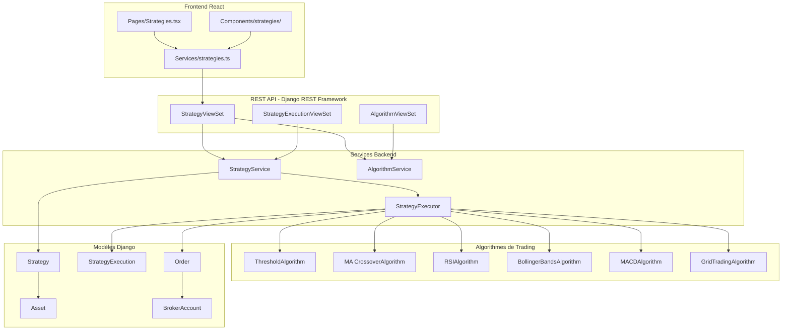
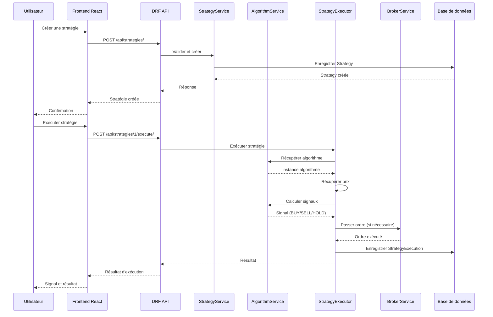

# Vue d'Ensemble - Système de Stratégies de Trading

## Introduction

Ce document présente une vue d'ensemble du système de stratégies de trading automatisées, adapté de la version 3 vers l'architecture moderne de la version 4. Le système permet aux utilisateurs de créer, configurer et exécuter des stratégies de trading basées sur différents algorithmes techniques.

## Architecture Générale

### Schéma d'Architecture

### Flux de Données

## Composants Principaux

### 1. Frontend React

**Technologies** :
- React 18+ avec TypeScript
- React Table (TanStack Table) pour les tableaux
- Axios pour les appels API
- React Hook Form pour les formulaires

**Pages principales** :
- `Pages/Strategies.tsx` : Liste et gestion des stratégies
- Composants modulaires pour la création, édition, historique

### 2. API REST (Django REST Framework)

**ViewSets** :
- `StrategyViewSet` : CRUD + actions personnalisées
- `StrategyExecutionViewSet` : Historique d'exécution
- Actions personnalisées : `execute`, `calculate-signal`, `activate`, `deactivate`

**Endpoints principaux** :
- `GET /api/strategies/` : Liste des stratégies
- `POST /api/strategies/` : Créer une stratégie
- `GET /api/strategies/{id}/` : Détails d'une stratégie
- `POST /api/strategies/{id}/execute/` : Exécuter une stratégie
- `GET /api/strategies/{id}/executions/` : Historique d'exécution

### 3. Services Backend

**StrategyService** :
- Logique métier pour les stratégies
- Calcul de `portfolio_quantity`
- Calcul de `optimal_quantity`
- Validation des stratégies

**AlgorithmService** :
- Gestion des algorithmes disponibles
- Validation des paramètres
- Factory pour instancier les algorithmes

**StrategyExecutor** :
- Exécution des stratégies
- Récupération des prix (Yahoo Finance, broker)
- Calcul des signaux
- Passage d'ordres via `BrokerService`

### 4. Algorithmes de Trading

Tous les algorithmes héritent de `TradingAlgorithm` et implémentent `calculate_signals()` :

- **ThresholdAlgorithm** : Seuils simples (acheter si prix ≤ seuil bas, vendre si prix ≥ seuil haut)
- **MovingAverageCrossoverAlgorithm** : Croisement de moyennes mobiles
- **RSIAlgorithm** : Relative Strength Index (survente/surachat)
- **BollingerBandsAlgorithm** : Bandes de Bollinger
- **MACDAlgorithm** : Moving Average Convergence Divergence
- **GridTradingAlgorithm** : Grid trading (trading de range)

### 5. Modèles Django

**Strategy** (étendu) :
- Informations de base (nom, description, utilisateur)
- Algorithme sélectionné et paramètres
- Configuration d'exécution (broker, mode, fréquence)
- Quantités cibles (min/max)
- Statut (active, inactive, paused)

**StrategyExecution** (nouveau) :
- Historique des exécutions
- Signal calculé
- Ordre exécuté (si applicable)
- Performance et statistiques

## Différences Version 3 → Version 4

### Interface Utilisateur

| Aspect | Version 3 | Version 4 |
|--------|-----------|-----------|
| **Framework** | Tabulator (jQuery) | React Table (React moderne) |
| **TypeScript** | Non | Oui |
| **Composants** | JavaScript inline dans templates | Composants React modulaires |
| **État** | Variables globales JavaScript | Hooks React et contexte |

### API Backend

| Aspect | Version 3 | Version 4 |
|--------|-----------|-----------|
| **Framework** | Vues Django classiques | Django REST Framework |
| **Sérialisation** | JSON manuel | Serializers DRF |
| **Permissions** | Décorateurs `@login_required` | Classes de permissions DRF |
| **Documentation** | Manuelle | Auto-générée (Swagger) |

### Architecture

| Aspect | Version 3 | Version 4 |
|--------|-----------|-----------|
| **Structure** | Monolithique Django | Découplée (API + Frontend) |
| **Algorithmes** | Mono-fichier `algorithms.py` | Dossier modulaire `algorithms/` |
| **Services** | Fonctions dans `views.py` | Services dédiés (`services/`) |
| **Tests** | Tests Django classiques | Tests DRF + tests frontend |

### Exécution

| Aspect | Version 3 | Version 4 |
|--------|-----------|-----------|
| **Automatique** | `AutomationService` Django | Tâches périodiques (Celery/Django-Q) |
| **Intégration** | Fonctions directes | Via `BrokerService` et `OrderViewSet` |
| **Logging** | Logging Django | Logging structuré avec contexte |

## Technologies Utilisées

### Backend

- **Django 5.x** : Framework web
- **Django REST Framework** : API REST
- **PostgreSQL** : Base de données
- **Celery** (optionnel) : Tâches asynchrones pour exécution automatique

### Frontend

- **React 18+** : Bibliothèque UI
- **TypeScript** : Typage statique
- **React Table (TanStack Table)** : Tableaux performants
- **React Hook Form** : Gestion de formulaires
- **Axios** : Client HTTP
- **Vite** : Build tool

### Bibliothèques Python

- **numpy** : Calculs numériques pour les algorithmes
- **pandas** : Manipulation de données (optionnel)
- **yfinance** : Récupération de prix Yahoo Finance

## Flux Utilisateur Typique

1. **Création d'une stratégie** :
   - L'utilisateur accède à la page `/strategies`
   - Clique sur "Créer une stratégie"
   - Remplit le formulaire (nom, asset, algorithme, paramètres)
   - Sélectionne le broker et le mode d'exécution
   - Configure les quantités cibles (optionnel)
   - Sauvegarde

2. **Configuration de l'algorithme** :
   - Sélectionne un algorithme dans le dropdown
   - Les paramètres spécifiques apparaissent dynamiquement
   - Configure les valeurs selon sa stratégie
   - Peut tester le calcul de signal sans exécuter

3. **Activation et exécution** :
   - Active la stratégie
   - Peut exécuter manuellement via le bouton "Exécuter"
   - Ou configure l'exécution automatique (selon `check_frequency`)

4. **Suivi des performances** :
   - Consulte l'historique d'exécution
   - Visualise les signaux générés
   - Vérifie les ordres passés
   - Analyse les performances et ajuste si nécessaire

## Intégrations

### Système d'Ordres

Le système de stratégies utilise le système d'ordres existant :
- Appel à `OrderViewSet.place()` pour passer des ordres
- Utilisation de `BrokerService` pour l'interaction avec les brokers
- Enregistrement des ordres dans la table `Order`

### Assets

- Utilise `AllAssets` pour l'autocomplétion lors de la création
- Crée automatiquement un `Asset` depuis `AllAssets` si nécessaire
- Utilise `Position` pour calculer `portfolio_quantity`

### Brokers

- Utilise `BrokerAccount` pour l'exécution des ordres
- Récupère les prix depuis le broker via `BrokerService`
- Supporte Binance et Saxo Bank

## Points Critiques

### Sécurité

- Vérification que l'utilisateur possède la stratégie
- Validation des paramètres côté serveur
- Protection contre les injections SQL/NoSQL
- Limitation de la fréquence d'exécution

### Performance

- Calcul des signaux optimisé
- Mise en cache des prix (si applicable)
- Exécution asynchrone pour les stratégies automatiques
- Pagination pour l'historique d'exécution

### Fiabilité

- Gestion des erreurs robuste
- Logging détaillé
- Retry automatique en cas d'échec réseau
- Validation des données avant exécution

## Prochaines Étapes

Pour implémenter ce système, suivez cette séquence :

1. **Modèles** : Étendre `Strategy` et créer `StrategyExecution` ([STRATEGIES_MODELS.md](STRATEGIES_MODELS.md))
2. **Algorithmes** : Implémenter les algorithmes de trading ([STRATEGIES_ALGORITHMS.md](STRATEGIES_ALGORITHMS.md))
3. **Services** : Créer les services backend ([STRATEGIES_SERVICES.md](STRATEGIES_SERVICES.md))
4. **API** : Étendre les ViewSets et créer les endpoints ([STRATEGIES_API.md](STRATEGIES_API.md))
5. **Frontend** : Développer l'interface React ([STRATEGIES_FRONTEND.md](STRATEGIES_FRONTEND.md))
6. **Exécution** : Implémenter l'exécution automatique ([STRATEGIES_EXECUTION.md](STRATEGIES_EXECUTION.md))
7. **Tests** : Tester avec des exemples ([STRATEGIES_EXAMPLES.md](STRATEGIES_EXAMPLES.md))

---

**Voir aussi** :
- [STRATEGIES_MODELS.md](STRATEGIES_MODELS.md) : Modèles de données
- [STRATEGIES_ALGORITHMS.md](STRATEGIES_ALGORITHMS.md) : Algorithmes de trading
- [STRATEGIES_API.md](STRATEGIES_API.md) : API REST
- [STRATEGIES_FRONTEND.md](STRATEGIES_FRONTEND.md) : Interface React

